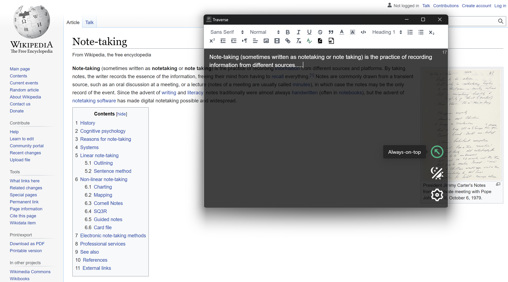

# Traverse
#### Simple notepad with adjustable transparency

  

  
  
  
  

### Always on top to keep your notes in sight
### With a to accomadate for different needs, with an included toggle for spellchecking

### Adjustable transparency with a toggleable toolbar

### Export your notes to PDF or MS Word

### Light and Dark Themes

